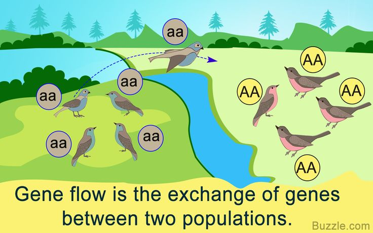
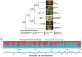
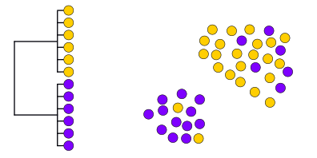
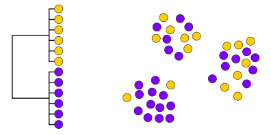
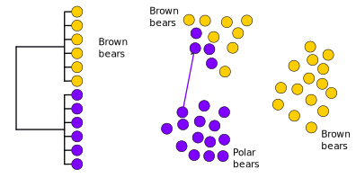
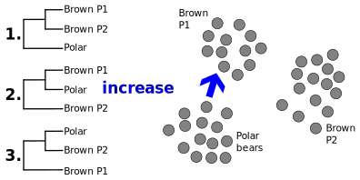

```{r setup, include = FALSE}
library(knitr)
library(ape)
```

<!-- adding bold and italic options -->
<style>
em {
  font-style: italic
}
strong {
  font-weight: bold;
}
</style>

## Molecular Ecology and Evolution at Bangor (MEEB)

- 3rd year module "Molecular ecology and evolution"
- https://www.bangor.ac.uk/meeb

```{r, out.width = "100%", dpi = 300, echo = FALSE, fig.align='center', fig.cap=""}
include_graphics("./assets/img/meeb_logo_NEW_no_text.jpg")
```

---

## Axel Barlow research group

- Population genomics, Paleogenomics, Conservation genomics
- Dissertation and MSc projects

```{r, out.width = "80%", dpi = 300, echo = FALSE, fig.align='center', fig.cap=""}
include_graphics("./assets/img/extinct_animals.png")
```

```{r, out.width = "80%", dpi = 300, echo = FALSE, fig.align='center', fig.cap=""}
include_graphics("./assets/img/sp4-6.png")
```

---

## Lecture schedule

1. Drift and variation (Evolution: Chapter 6)
2. Conservation genetics (Evolution: Chapter 6)
3. Phylogeny 1 (Evolution: Chapter 16)
4. **Phylogeny 2 (Evolution: Chapter 16)**

---

## Summary lecture 1

- What a phylogeny is
- Phylogenetics, morphological and genetic data
- **gene trees**
- Uses of phylogenetic trees

## Lecture 2

- key concepts
- How does the gene tree form?
- lineage sorting
- Incomplete lineage sorting
- Admixture

--- .segue .dark 

## Key concepts

--- &twocol

## Populations and species

*** =left

- A group of individuals capable of reproducing
- Reproduction within populations > between populations
- Ancestral populations diverge creating new populations
- Identified by differences in allele frequencies
- **Species** fulfil the same criteria
- No difference from a population genetics viewpoint

*** =right

```{r, out.width = "75%", dpi = 300, echo = FALSE, fig.align='right', fig.cap=""}
include_graphics("./assets/img/pop1598571799_642096.png")
```

--- &twocol

## Gene tree (single locus tree)

*** =left

- Evolutionary history of a single locus
- (not always an actual gene)
- Each locus has its own gene tree


*** =right

```{r, out.width = "75%", dpi = 300, echo = FALSE, fig.align='right', fig.cap=""}
include_graphics("./assets/img/Gene_Loci_and_Alleles.png")
```

--- &twocol

## Species tree

*** =left

- The **actual** history of populations or species
- Gene trees evolve within the species tree
- May differ due to:
  - **incomplete lineage sorting**
  - **admixture**
- Often what we are trying to infer
  - Concatenation
  - Multispecies coalescent models

*** =right

```{r, out.width = "100%", dpi = 300, echo = FALSE, fig.align='right', fig.cap=""}
include_graphics("./assets/img/gene-tree-incongruence-figure.jpg")
```

---

## Admixture

- Post divergence genetic exchange between populations/species
- Gene flow, admixture, hybridisation. 

```{r, out.width = "70%", dpi = 300, echo = FALSE, fig.align='center', fig.cap=""}

```

--- .segue .dark 

## How does the tree form?

---

## How does the tree form: lineage sorting

```{r, out.width = "100%", dpi = 300, echo = FALSE, fig.align = "center", fig.cap=""}
  include_graphics("./assets/img/linsort1.svg")
```

---

## How does the tree form: lineage sorting

```{r, out.width = "100%", dpi = 300, echo = FALSE, fig.align = "center", fig.cap=""}
  include_graphics("./assets/img/linsort2.svg")
```

---

## How does the tree form: lineage sorting

```{r, out.width = "100%", dpi = 300, echo = FALSE, fig.align = "center", fig.cap=""}
  include_graphics("./assets/img/linsort3.svg")
```

---

## How does the tree form: lineage sorting

```{r, out.width = "100%", dpi = 300, echo = FALSE, fig.align = "center", fig.cap=""}
  include_graphics("./assets/img/linsort4.svg")
```

---

## How does the tree form: lineage sorting

```{r, out.width = "100%", dpi = 300, echo = FALSE, fig.align = "center", fig.cap=""}
  include_graphics("./assets/img/linsort5.svg")
```

---

## Lineage sorting summary

- Drift sorts the lineages into clades
- This takes time, we can't detect the divergence immediately
- We go through stages of incomplete/complete monophyly
- incomplete to complete lineage sorting
- lineage sorting is faster when the population size is small (= more drift)
- Mutation builds upon the clades, monophyly is retained [unless there is gene flow]

**Gene trees may not match the species tree when:**

- We catch the process part way through
- Lineages are not sorted prior to the next divergence/speciation event
- Admixture

--- bg:white

## Big cats

```{r, out.width = "80%", dpi = 300, echo = FALSE, fig.align = "center", fig.cap="", fig.cap=""}
  
```

---

## Lineage sorting summary

- Drift sorts the lineages into clades
- This takes time, we can't detect the divergence immediately
- We go through stages of incomplete/complete monophyly
- incomplete to complete lineage sorting
- lineage sorting is faster when the population size is small (= more drift)
- Mutation builds upon the clades, monophyly is retained [unless there is gene flow]

Gene trees may not match the species tree when:

- We catch the process part way through
- **Lineages are not sorted prior to the next divergence/speciation event**
- Admixture

---

## Divergence with complete lineage sorting

```{r, out.width = "100%", dpi = 300, echo = FALSE, fig.align = "center", fig.cap=""}
  include_graphics("./assets/img/beary1.svg")
```

---

## Divergence with complete lineage sorting

```{r, out.width = "100%", dpi = 300, echo = FALSE, fig.align = "center", fig.cap=""}
  include_graphics("./assets/img/beary2.svg")
```

---

## Divergence with complete lineage sorting

```{r, out.width = "100%", dpi = 300, echo = FALSE, fig.align = "center", fig.cap=""}
  
```

---

## Divergence with complete lineage sorting

```{r, out.width = "100%", dpi = 300, echo = FALSE, fig.align = "center", fig.cap=""}
  include_graphics("./assets/img/beary4.svg")
```

---

## Divergence with complete lineage sorting

```{r, out.width = "100%", dpi = 300, echo = FALSE, fig.align = "center", fig.cap=""}
  include_graphics("./assets/img/beary5.svg")
```

--- .segue .dark 

## What if lineage sorting is incomplete?

---

## Divergence with incomplete lineage sorting

```{r, out.width = "100%", dpi = 300, echo = FALSE, fig.align = "center", fig.cap=""}
  include_graphics("./assets/img/beary1.svg")
```

---

## Divergence with incomplete lineage sorting

```{r, out.width = "100%", dpi = 300, echo = FALSE, fig.align = "center", fig.cap=""}
  include_graphics("./assets/img/beary2.svg")
```

---

## Divergence with incomplete lineage sorting

```{r, out.width = "100%", dpi = 300, echo = FALSE, fig.align = "center", fig.cap=""}
  
```

---

## Divergence with incomplete lineage sorting

```{r, out.width = "100%", dpi = 300, echo = FALSE, fig.align = "center", fig.cap=""}
  
```

--- .segue .dark 

## Or...

---

## Divergence with incomplete lineage sorting

```{r, out.width = "100%", dpi = 300, echo = FALSE, fig.align = "center", fig.cap=""}
  
```

---

## Divergence with incomplete lineage sorting

```{r, out.width = "100%", dpi = 300, echo = FALSE, fig.align = "center", fig.cap=""}
  
```

---

## Simulator

<iframe src = 'https://heavywatal.github.io/driftr.js/'></iframe>

---

## Summary

- [Note these a just some of the many outcomes you could imagine]
- The danger zone is when alleles fail to reach fixation early in the speciation process
- i.e. prior to SpA population divergence in the example
- Because there is no selection for specific alleles, the process is random
- Either SpA population may end up grouping with SpB

---

## Relying on a single locus tree could be misleading

- Recent divergence with large populations more likely to cause problems
- But no way of easily predicting/testing this from a single tree

### Solution: multiple loci

- Generate data from several loci
- Divide whole genome sequences into loci
- Increased statistical confidence
- Can also quantify ILS (says something about pop size and divergence time)
- Potential to study **admixture**

--- .segue .dark 

## Multi-locus phylogenetics

--- &twocol

## Brown bear and polar bears

*** =left

```{r, out.width = "100%", dpi = 300, echo = FALSE, fig.align = "center", fig.cap=""}
  include_graphics("./assets/img/arctos_mt.svg")
```

*** =right

```{r, out.width = "100%", dpi = 300, echo = FALSE, fig.align = "center", fig.cap=""}
  include_graphics("./assets/img/arctos_map.svg")
```

- Brown bears not monophyletic
- Divergence time ~120 Ka
- Incomplete lineage sorting (result of recent speciation)?
- Something else?
- Multiple divergent brown bear clades
- Evidence of glacial refugia

--- bg:white

## Brown bear and polar bear Y chromosome

```{r, out.width = "100%", dpi = 300, echo = FALSE, fig.align = "center", fig.cap=""}
  include_graphics("./assets/img/arctos_y.svg")
```

--- &twocol bg:white

## Brown bear and polar bear autosomes

*** =left

```{r, out.width = "80%", dpi = 300, echo = FALSE, fig.align = "center", fig.cap=""}
  include_graphics("./assets/img/arctos_auto.svg")
```

*** =right

- mtDNA suggests recent speciation and brown bear glacial refugia
- Y chromosome suggests species monophyly, no evidence of brown bear refugia
- Autosomes show species monophyly, and that the species are OLD (latest estimates, 1 million years)

### Explanation

- The 2 species are old and distinct
- Males move about more than females
- More recent mtDNA divergence may suggest **admixture**

--- .segue .dark 

## Detecting admixture

---

## Divergence with incomplete lineage sorting

```{r, out.width = "100%", dpi = 300, echo = FALSE, fig.align = "center", fig.cap=""}
  
```

---

## Divergence with incomplete lineage sorting

```{r, out.width = "100%", dpi = 300, echo = FALSE, fig.align = "center", fig.cap=""}
  include_graphics("./assets/img/ils4 (copy).svg")
```

---

## Divergence with incomplete lineage sorting

```{r, out.width = "100%", dpi = 300, echo = FALSE, fig.align = "center", fig.cap=""}
  include_graphics("./assets/img/ils5 (copy).svg")
```

---

## Expected tree frequecies under ILS?

```{r, out.width = "100%", dpi = 300, echo = FALSE, fig.align = "center", fig.cap=""}
  include_graphics("./assets/img/freq.svg")
```

--- .segue .dark 

## What about admixture?

---

## Divergence with admixture

```{r, out.width = "100%", dpi = 300, echo = FALSE, fig.align = "center", fig.cap=""}
  include_graphics("./assets/img/beary5 (copy).svg")
```

---

## Divergence with admixture

```{r, out.width = "100%", dpi = 300, echo = FALSE, fig.align = "center", fig.cap=""}
  
```

---

## Divergence with admixture

```{r, out.width = "100%", dpi = 300, echo = FALSE, fig.align = "center", fig.cap=""}
  include_graphics("./assets/img/bearyG2.svg")
```

---

## Expected tree frequencies with admixture?

```{r, out.width = "100%", dpi = 300, echo = FALSE, fig.align = "center", fig.cap=""}
  
```

---

## Summary

- An imbalance in the non-species tree topologies provides evidence of gene flow
- Only works if you have sequenced a LOT of loci (whole genomes)
- Can detect very ancient events
- Sometimes based on SNPs (D statistics, F-ratio statistics), essentially the same
- Revealed many examples of admixture in the past decade


--- &twocol

## Brown bear and polar bears

*** =left

```{r, out.width = "100%", dpi = 300, echo = FALSE, fig.align = "center", fig.cap=""}
  include_graphics("./assets/img/arctos_mt.svg")
```

*** =right

**Nuclear genomes, 100 kb windows**

```{r, out.width = "80%", dpi = 300, echo = FALSE, fig.align = "center", fig.cap=""}
  include_graphics("./assets/img/abc.svg")
```

---

## Brown bear and polar bear reading

```{r, out.width = "100%", out.height=500, dpi = 300, echo = FALSE, fig.cap=""}
  include_graphics("./assets/img/2015-Genomic_evidence_of_geographically_widespread_effect_of_gene_flow_from_polar_bears_into_brown_bears..pdf")
```

---

## Brown bear and polar bear reading

```{r, out.width = "100%", out.height=500, dpi = 300, echo = FALSE, fig.cap=""}
  include_graphics("./assets/img/2014-Brown_and_polar_bear_y_chromosomes_reveal_extensive_male-biased_gene_flow_within_brother_lineages.pdf")
```

--- &twocol

## Cave bears and brown bears

*** =left

- Cave bears are sister lineage to brown bears and polar bears
- Giant vegan bears
- Extinct ~25 Ka
- Lived alongside brown bears for most of their evolutionary history

*** =right

```{r, out.width = "100%", dpi = 300, echo = FALSE, fig.align = "center", fig.cap=""}
  include_graphics("./assets/img/kudarensis.png")
```

```{r, out.width = "90%", dpi = 300, echo = FALSE, fig.align = "center", fig.cap=""}
  include_graphics("./assets/img/Ursus_spelaeus_Sergiodlarosa.jpg")
```

--- &twocol

## Cave bears and brown bears

*** =left

**Nuclear genomes, 25 kb windows**

```{r, out.width = "80%", dpi = 300, echo = FALSE, fig.align = "center", fig.cap=""}
  
```
*** =right

```{r, out.width = "100%", dpi = 300, echo = FALSE, fig.align = "center", fig.cap=""}
  include_graphics("./assets/img/kudarensis.png")
```

```{r, out.width = "90%", dpi = 300, echo = FALSE, fig.align = "center", fig.cap=""}
  include_graphics("./assets/img/Ursus_spelaeus_Sergiodlarosa.jpg")
```

---

## Cave bear reading

```{r, out.width = "100%", out.height=500, dpi = 300, echo = FALSE, fig.cap=""}
  include_graphics("./assets/img/Barlow et al. - 2018 - Partial genomic survival of cave bears in living brown bears.pdf")
```

--- &twocol

## Neanderthals and anatomically modern humans

*** =left

- Extinct population of humans
- Extinct ~40 Ka
- Basically a human (many morphological characters overlapping)
- Advanced culture, hunting technology, art, etc.
- Major dispersal of anatomically modern humans 70-50 Ka
- Population replacement or admixture?

*** =right

```{r, out.width = "100%", dpi = 300, echo = FALSE, fig.align = "center", fig.cap=""}
  include_graphics("./assets/img/neanderthal_woman-4x3.jpg")
```

--- &twocol

## Neanderthals and anatomically modern humans

*** =left

```{r, out.width = "100%", dpi = 300, echo = FALSE, fig.align = "center", fig.cap=""}
  
```

[SNP based analysis, but essentially the same]

*** =right

```{r, out.width = "100%", dpi = 300, echo = FALSE, fig.align = "center", fig.cap=""}
  include_graphics("./assets/img/neanderthal_woman-4x3.jpg")
```

---

## Neanderthal reading

```{r, out.width = "100%", out.height=500, dpi = 300, echo = FALSE, fig.cap=""}
  include_graphics("./assets/img/2010-A_draft_sequence_of_the_Neandertal_genome..pdf")
```

--- &thankyou

## Thank you 
